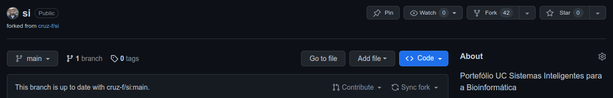

# Intelligent Systems for Bioinformatics

## Curricular Unit
Master in Bioinformatics, University of Minho, 2023-2024.


## Description
A package of machine learning algorithms to grasp the concepts of the course.
Students should implement essential algorithms from scratch using numpy and pandas.
Implementations must follow a common and simple API.


## Setup
To get started, fork the repository from GitHub and clone it to your local machine.

Fork the following GitHub repository: https://github.com/jcorreia11/si.git


Then, clone the repository to your local machine:
```bash
git clone https://github.com/YOUR_USERNAME/si.git
```

Open the repository in your favorite IDE and install the dependencies (if missing):
```bash
pip install -r requirements.txt
```
or
```bash
pip install numpy pandas scipy matplotlib
```
Note: You can also create a similar Python package and push it to your GitHub.

Make a change to the repository: Add your co-authorship to the _\_\_init\_\_.py_ file (within the si folder):
```python
__author__ = "YOUR_NAME" 
__credits__ = ["YOUR_NAME"]
__license__ = "Apache License 2.0"
__version__ = "0.0.1"
__maintainer__ = "YOUR_NAME"
__email__ = "YOUR_EMAIL"
```

Then, commit it to your local repository and publish it to your GitHub:
```bash
git add src/si/__init__.py
git commit -m "Adding my co-authorship to the package"
git push origin main
```
Note: you can also use the IDE Git tools.

## Update you fork with the latest changes from the original repository

Option 1:

- Manually copy the changes from the original repository to your fork.

Option 2:

- You can perform a “Reverse Pull Request” on GitHub. A reverse pull request will follow the same steps as a regular
    pull request. However, in this case, your fork becomes the base and your colleague’s repo is the head.
    You can do it directly on GitHub by clicking on the “New pull request” button on your forked repo.
    Then, you need to change the base fork to your forked repo and the head fork to the original repo.
    Finally, you need to click on the “Create pull request” button.
    You can then merge the pull request.

Option 3:

- You can use the command line to update your forked repo with the original repo.
    First, you need to add the original repo as a remote.
    Then, you need to pull the original repo into your local repo.
    Finally, you need to merge the original repo into your forked repo.

```bash
git remote add upstream https://github.com/jcorreia11/si.git
git pull upstream main
git push origin main
```


## Architecture
The package is organized as follows:
```
si
├── src
│   ├── si
│   │   ├── __init__.py
│   │   ├── data
│   │   │   ├── __init__.py
├── datasets
│   ├── README.md
│   ├── ...
├── scripts
│   ├── README.md
│   ├── ...
├── ... (python package configuration files)
```

A tour to Python packages:
- The _src_ folder contains the source code of the package. It should contain an intermediate file 
called _si_ (the name of the package) and the modules of the package. All python packages and subpackages
must also contain a file called _\_\_init\_\_.py_.
- The _datasets_ folder contains the datasets used in the scripts.
- The _scripts_ folder contains the scripts used to test the package and include examples.

Note: It is also common to have a _tests_ folder to include the unit tests of the package. However,
we will not cover this topic in this course.

Note: A python package also contains many configuration files (e.g., _setup.py_, _requirements.txt_, etc.).

## Datasets
All datasets are available at: [https://www.dropbox.com/sh/oas4yru2r9n61hk/AADpRunbqES44W49gx9deRN5a?dl=0](https://www.dropbox.com/sh/oas4yru2r9n61hk/AADpRunbqES44W49gx9deRN5a?dl=0)

## Credits
This package is heavily inspired and adapted from:
- [https://github.com/vmspereira/si](https://github.com/vmspereira/si)
- [https://github.com/cruz-f/si](https://github.com/cruz-f/si)
